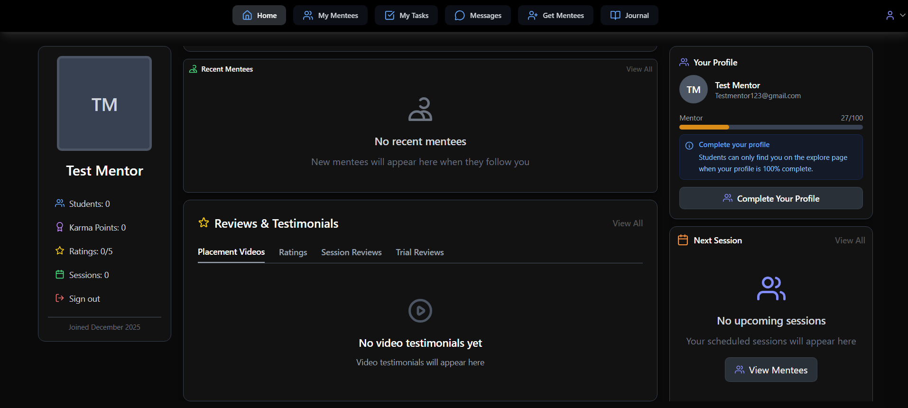
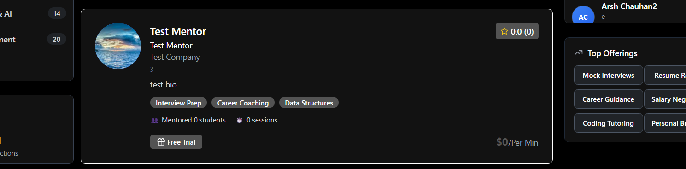
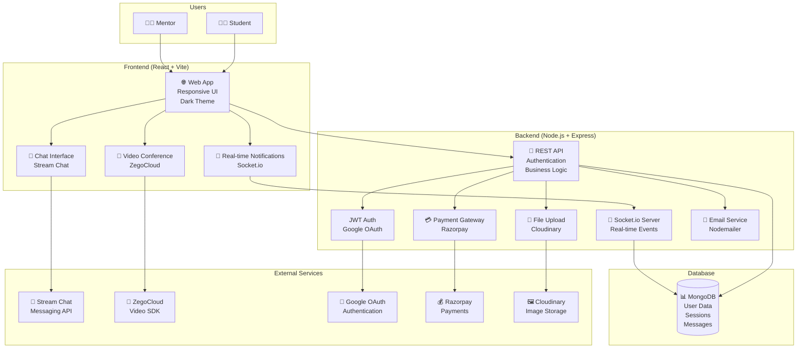
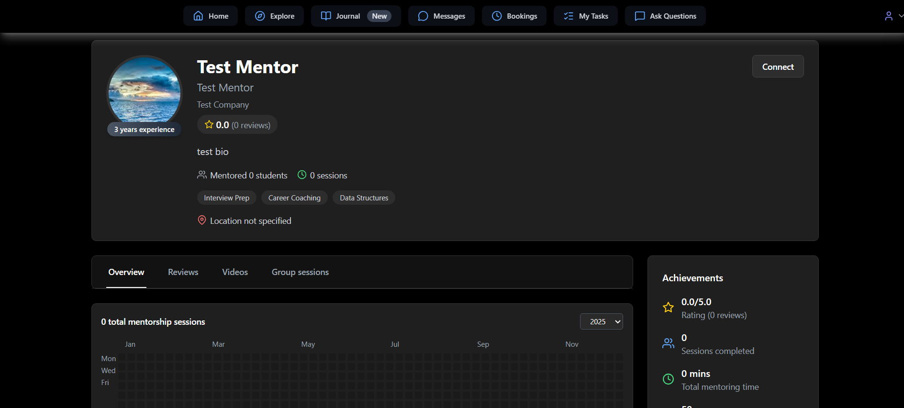

<div align="center">
  
  
  # 🎓 MentorLink - Connect, Learn, Grow
  
  ### *Your Gateway to Expert Mentorship and Collaborative Learning*
  
  [](https://reactjs.org/)
  [](https://vitejs.dev/)
  [](https://tailwindcss.com/)
  [](https://socket.io/)
  [](LICENSE)
  

  
</div>

---


## 📚 Table of Contents

- [📸 Platform Showcase](#-platform-showcase)
- [✨ Features](#-features)
- [🛠️ Tech Stack](#️-tech-stack)
- [🏗️ Architecture](#️-architecture)
- [🚀 Getting Started](#-getting-started)
- [📁 Project Structure](#-project-structure)
- [🔌 API Endpoints](#-api-endpoints)
- [🗄️ Database Schema](#️-database-schema)
- [🎨 Key Features Explained](#-key-features-explained)
- [🔧 Configuration](#-configuration)
- [🧪 Testing](#-testing)
- [🧯 Common Setup Errors & Fixes](#-common-setup-errors--fixes)
- [🚢 Deployment](#-deployment)
- [🤝 Contributing](#-contributing)
- [📄 License](#-license)

---

## 📸 Platform Showcase

<div align="center">
  
  ### 🎯 Mentor Dashboard
  
  
  ### 👨‍🎓 Student Dashboard
  
  
  ### 🤝 Connect & Collaborate
  
  
</div>

---

## ✨ Features

### 🎯 For Students
- **🔍 Smart Mentor Discovery** - Find mentors based on skills, expertise, and ratings
- **📅 Session Booking** - Schedule 1-on-1 mentoring sessions with ease
- **💬 Real-time Chat** - Instant messaging with mentors using Stream Chat
- **🎥 Video Conferencing** - High-quality video sessions powered by ZegoCloud
- **📝 Task Management** - Track assignments and progress with your mentor
- **🏆 Karma System** - Earn points for profile completion, sessions, and engagement
- **💭 Community Forum** - Ask questions and get answers from the community
- **📊 Progress Tracking** - Monitor your learning journey and achievements

### 👨‍🏫 For Mentors
- **📋 Mentee Management** - Manage all your students in one place
- **⏰ Session Scheduling** - Control your availability and bookings
- **💰 Earnings Dashboard** - Track your income and payment history
- **📈 Analytics** - View session stats and student progress
- **✍️ Profile Customization** - Showcase your skills, experience, and social links
- **🎯 Task Assignment** - Create and track tasks for your mentees
- **⭐ Reviews & Ratings** - Build your reputation through student feedback
- **💬 Direct Messaging** - Stay connected with your mentees

### 🌟 Platform Highlights
- **🔐 Secure Authentication** - JWT-based auth with Google OAuth integration
- **🎨 Modern UI/UX** - Beautiful dark theme with smooth animations
- **📱 Responsive Design** - Works seamlessly on desktop, tablet, and mobile
- **⚡ Real-time Updates** - Live notifications and instant messaging
- **🔔 Smart Notifications** - Stay updated on bookings, messages, and tasks
- **💳 Payment Integration** - Secure payment processing with Razorpay
- **🎓 Skill-based Matching** - Connect with mentors in your field of interest

---

## 🛠️ Tech Stack

### Frontend
| Technology | Purpose | Version |
|------------|---------|---------|
| **React** | UI Framework | 19.1.1 |
| **Vite** | Build Tool | 7.1.7 |
| **TailwindCSS** | Styling | 3.4.18 |
| **React Router** | Navigation | 7.9.6 |
| **Axios** | HTTP Client | 1.13.2 |
| **Socket.io Client** | Real-time Communication | 4.8.1 |
| **Stream Chat** | Messaging Service | 9.26.1 |
| **ZegoCloud** | Video Conferencing | 2.17.1 |
| **Framer Motion** | Animations | 12.23.26 |
| **Lucide React** | Icons | 0.553.0 |
| **React Toastify** | Notifications | 11.0.5 |
| **JWT Decode** | Token Management | 4.0.0 |
| **Date-fns** | Date Utilities | 4.1.0 |

### Backend
| Technology | Purpose | Version |
|------------|---------|---------|
| **Node.js** | Runtime | >=18.0.0 |
| **Express** | Web Framework | 5.1.0 |
| **MongoDB** | Database | 8.19.3 |
| **Mongoose** | ODM | 8.19.3 |
| **Socket.io** | WebSocket Server | 4.7.5 |
| **JWT** | Authentication | 9.0.2 |
| **Bcrypt** | Password Hashing | 6.0.0 |
| **Cloudinary** | Image Storage | 2.8.0 |
| **Razorpay** | Payment Gateway | 2.9.6 |
| **Nodemailer** | Email Service | 6.9.16 |
| **Zod** | Validation | 4.1.12 |

---

## 🏗️ Architecture

### System Architecture Overview



### Architecture Components

#### 🎨 Frontend Architecture
- **Single Page Application (SPA)** built with React 19
- **Component-based architecture** with reusable UI components
- **State management** using React Context and hooks
- **Real-time communication** via Socket.io and WebSocket connections
- **Responsive design** with TailwindCSS for mobile-first approach

#### ⚙️ Backend Architecture
- **RESTful API** design with Express.js framework
- **Microservices-ready** structure with modular controllers
- **Real-time capabilities** using Socket.io for live updates
- **Authentication & Authorization** with JWT tokens and OAuth
- **File handling** with Cloudinary integration for media uploads

#### 🗄️ Data Architecture
- **Document-based database** using MongoDB with Mongoose ODM
- **Schema validation** with Zod for input validation
- **Indexing strategy** for optimal query performance
- **Data relationships** managed through references and population

#### 🔗 Integration Architecture
- **Third-party services** integration (Stream Chat, ZegoCloud, Razorpay)
- **OAuth 2.0** flow for Google authentication
- **Webhook handling** for payment confirmations
- **Email service** integration for notifications

#### 📡 Real-time Architecture
- **WebSocket connections** for instant messaging and notifications
- **Room-based communication** for video conferencing
- **Event-driven updates** for live dashboard data
- **Connection management** with automatic reconnection

---

## 🚀 Getting Started

### Prerequisites

Before you begin, ensure you have the following installed:
- **Node.js** (v18 or higher) - [Download](https://nodejs.org/)
- **MongoDB** (v6 or higher) - [Download](https://www.mongodb.com/try/download/community)
- **Git** - [Download](https://git-scm.com/)

### Installation

#### 1️⃣ Clone the Repository
```bash
git clone https://github.com/arshchouhan/MentorLink.git
cd MentorLink
```

#### 2️⃣ Backend Setup
```bash
cd Backend
npm install
```

Create a `.env` file in the Backend directory:
```env
# Server Configuration
PORT=4000
NODE_ENV=development

# Database
MONGO_URI=mongodb://localhost:27017/mentorlink

# Authentication
JWT_SECRET=your_super_secret_jwt_key_here

# Cloudinary (Image Upload)
CLOUDINARY_CLOUD_NAME=your_cloud_name
CLOUDINARY_API_KEY=your_api_key
CLOUDINARY_API_SECRET=your_api_secret

# Payment Gateway
RAZORPAY_KEY_ID=your_razorpay_key
RAZORPAY_KEY_SECRET=your_razorpay_secret

# Email Service
EMAIL_USER=your_email@gmail.com
EMAIL_PASS=your_app_password

# Stream Chat
STREAM_API_KEY=your_stream_api_key
STREAM_API_SECRET=your_stream_api_secret

# Google OAuth
GOOGLE_CLIENT_ID=your_google_client_id
GOOGLE_CLIENT_SECRET=your_google_client_secret

# Java Microservices (Optional)
JAVA_KARMA_API=http://localhost:8081/api/karma
```

#### 3️⃣ Frontend Setup
```bash
cd ../Frontend
npm install
```

Create a `.env.local` file in the Frontend directory:
```env
VITE_API_URL=http://localhost:4000/api
VITE_STREAM_CHAT_API_KEY=your_stream_api_key
VITE_GOOGLE_CLIENT_ID=your_google_client_id
VITE_RAZORPAY_KEY_ID=your_razorpay_key
```

#### 4️⃣ Run the Application

**Start Backend Server:**
```bash
cd Backend
npm run dev
# Server runs on http://localhost:4000
```

**Start Frontend Development Server:**
```bash
cd Frontend
npm run dev
# App runs on http://localhost:5173
```

---

## 📁 Project Structure

### Frontend Structure
```
Frontend/
├── src/
│   ├── assets/              # Images, logos, and static files
│   │   ├── Logo.png
│   │   ├── MentorDahboard.png
│   │   ├── studentdashbaordimage.png
│   │   └── connect*.png
│   ├── components/          # Reusable React components
│   │   ├── Chat/           # Chat components
│   │   ├── Forum/          # Forum components
│   │   ├── StudentChat/    # Student chat components
│   │   └── ...
│   ├── config/             # Configuration files
│   │   ├── apiConfig.js    # Backend switcher (Node.js/Java)
│   │   └── zegoConfig.js   # Video conference config
│   ├── context/            # React Context providers
│   ├── hooks/              # Custom React hooks
│   ├── pages/              # Page components
│   │   ├── MentorDashboard.jsx
│   │   ├── StudentDashboard.jsx
│   │   ├── MeetingRoomZego.jsx
│   │   └── ...
│   ├── services/           # API service layer
│   │   ├── authService.js
│   │   ├── messageService.js
│   │   ├── forumService.js
│   │   └── ...
│   ├── utils/              # Utility functions
│   ├── App.jsx             # Main app component
│   └── main.jsx            # Entry point
├── package.json
└── vite.config.js
```

### Backend Structure
```
Backend/
├── config/
│   └── db.js               # MongoDB connection
├── controllers/            # Route controllers
│   ├── auth.controller.js
│   ├── mentor.controller.js
│   ├── user.controller.js
│   ├── message.controller.js
│   ├── forum.controller.js
│   └── ...
├── models/                 # Mongoose schemas
│   ├── user.model.js
│   ├── mentorProfile.model.js
│   ├── booking.model.js
│   ├── message.model.js
│   └── ...
├── routes/                 # API routes
│   ├── auth.routes.js
│   ├── mentor.routes.js
│   ├── message.routes.js
│   └── ...
├── middleware/
│   └── auth.middleware.js  # JWT authentication
├── socket/                 # Socket.IO handlers
│   ├── socketHandlers.js   # Meeting rooms
│   └── chatSocketHandlers.js # Chat messaging
├── utils/
│   └── generateToken.js
├── index.js                # Server entry point
└── package.json
```

---

## 🔌 API Endpoints

### Authentication
```http
POST   /api/auth/register          # Register new user
POST   /api/auth/login             # Login user
POST   /api/auth/google            # Google OAuth login
POST   /api/auth/logout            # Logout user
POST   /api/auth/forgot-password   # Request password reset
POST   /api/auth/reset-password    # Reset password
```

### Users
```http
GET    /api/user/me                # Get current user
PUT    /api/user/student           # Update student profile
GET    /api/user/:id               # Get user by ID
```

### Mentors
```http
GET    /api/mentors                # Get all mentors (with filters)
GET    /api/mentors/:id            # Get mentor by ID
POST   /api/mentors                # Create/update mentor profile
POST   /api/mentors/upload-photo   # Upload profile photo
DELETE /api/mentors/upload-photo   # Remove profile photo
```

### Bookings/Sessions
```http
POST   /api/bookings               # Create booking
GET    /api/bookings               # Get user's bookings
GET    /api/bookings/mentor        # Get mentor's bookings
POST   /api/bookings/:id/join      # Join session
PUT    /api/bookings/:id/status    # Update booking status
```

### Messages
```http
GET    /api/messages/conversations         # Get all conversations
GET    /api/messages/conversations/:id/messages  # Get messages
POST   /api/messages/send                  # Send message
PUT    /api/messages/conversations/:id/read      # Mark as read
```

### Forum
```http
GET    /api/forum/questions        # Get all questions
POST   /api/forum/questions        # Create question
GET    /api/forum/questions/:id    # Get question by ID
POST   /api/forum/questions/:id/answer    # Answer question
POST   /api/forum/questions/:id/upvote    # Upvote question
```

### Tasks
```http
GET    /api/tasks                  # Get mentor's tasks
POST   /api/tasks                  # Create task
PUT    /api/tasks/:id              # Update task
DELETE /api/tasks/:id              # Delete task
GET    /api/tasks/mentee/:id       # Get mentee's tasks
```

---

## 🗄️ Database Schema

### Core Models

#### User Model
```javascript
{
  _id: ObjectId,
  name: String (required),
  email: String (required, unique),
  password: String (required, hashed),
  role: String (enum: ['student', 'mentor']),
  profilePicture: String (Cloudinary URL),
  isVerified: Boolean (default: false),
  karmaPoints: Number (default: 0),
  createdAt: Date,
  updatedAt: Date
}
```

#### Mentor Profile Model
```javascript
{
  _id: ObjectId,
  userId: ObjectId (ref: 'User'),
  bio: String,
  skills: [String],
  experience: Number (years),
  hourlyRate: Number,
  availability: [{
    day: String,
    slots: [{
      startTime: String,
      endTime: String,
      isBooked: Boolean
    }]
  }],
  socialLinks: {
    linkedin: String,
    github: String,
    portfolio: String
  },
  rating: Number (1-5),
  reviewCount: Number,
  totalEarnings: Number
}
```

#### Booking Model
```javascript
{
  _id: ObjectId,
  studentId: ObjectId (ref: 'User'),
  mentorId: ObjectId (ref: 'User'),
  sessionDate: Date,
  startTime: String,
  endTime: String,
  status: String (enum: ['pending', 'confirmed', 'completed', 'cancelled']),
  topic: String,
  meetingRoomId: String (ZegoCloud),
  paymentId: String (Razorpay),
  amount: Number,
  createdAt: Date
}
```

#### Message Model
```javascript
{
  _id: ObjectId,
  conversationId: String (Stream Chat),
  senderId: ObjectId (ref: 'User'),
  receiverId: ObjectId (ref: 'User'),
  content: String,
  messageType: String (enum: ['text', 'question', 'insight', 'advice', 'action']),
  isRead: Boolean (default: false),
  createdAt: Date
}
```

#### Task Model
```javascript
{
  _id: ObjectId,
  mentorId: ObjectId (ref: 'User'),
  menteeId: ObjectId (ref: 'User'),
  title: String,
  description: String,
  status: String (enum: ['not_started', 'in_progress', 'pending_review', 'completed']),
  priority: String (enum: ['low', 'medium', 'high']),
  dueDate: Date,
  progress: Number (0-100),
  createdAt: Date,
  updatedAt: Date
}
```

#### Review Model
```javascript
{
  _id: ObjectId,
  bookingId: ObjectId (ref: 'Booking'),
  reviewerId: ObjectId (ref: 'User'),
  revieweeId: ObjectId (ref: 'User'),
  rating: Number (1-5),
  comment: String,
  createdAt: Date
}
```

---

## 🎨 Key Features Explained

### 🎥 Video Conferencing
- **ZegoCloud Integration** - Professional video/audio quality
- **Screen Sharing** - Share your screen during sessions
- **Real-time Chat** - Text chat during video calls
- **Custom Branding** - Themed to match platform design

### 💬 Real-time Messaging
- **Stream Chat SDK** - Enterprise-grade messaging
- **Message Types** - Normal, questions, insights, advice, action items
- **Read Receipts** - Know when messages are read
- **Typing Indicators** - See when others are typing
- **Message History** - All conversations saved to database

### 🏆 Karma System
Earn karma points for various activities:
- ✅ Profile Completion - 50 points
- ✅ Session Completed - 30 points
- ✅ Message Sent - 5 points
- ✅ Skill Added - 10 points
- ✅ Goal Set - 15 points

### 📊 Task Management
- **Create Tasks** - Mentors assign tasks to mentees
- **Track Progress** - Monitor completion percentage
- **Status Updates** - Not Started → In Progress → Pending Review → Completed
- **Priority Levels** - High, Medium, Low

---

## 🔧 Configuration

### Backend Switching
The platform supports switching between Node.js and Java backends. Edit `Frontend/src/config/apiConfig.js`:

```javascript
const ACTIVE_BACKEND = 'nodejs'; // or 'java'

const BACKEND_URLS = {
  nodejs: 'http://localhost:4000/api',
  java: 'http://localhost:8081/api'
};
```

### ZegoCloud Theme
Customize video conference theme in `Frontend/src/config/zegoConfig.js`:
- Colors, branding, and UI elements
- Matches platform's dark theme with indigo accents

---

## 🧪 Testing

### Run Frontend Tests
```bash
cd Frontend
npm run lint
```

### Run Backend Tests
```bash
cd Backend
npm run dev
```

### Test Video Conferencing
1. Create a booking between mentor and student
2. Click "Join Session" when session time arrives
3. Both users should connect to the same room

### Test Real-time Chat
1. Open mentor and student dashboards in separate windows
2. Send messages from either side
3. Messages should appear instantly

---

## 🚢 Deployment

### Frontend Deployment (Vercel/Netlify)
```bash
cd Frontend
npm run build
# Deploy the 'dist' folder
```

### Backend Deployment (Heroku/Railway)
```bash
cd Backend
# Set environment variables on hosting platform
npm start
```

---

## 🧯 Common Setup Errors & Fixes

This section helps contributors quickly diagnose common issues encountered during local setup.

### 🔴 Backend server not starting
**Cause:**
- Missing or incorrect `.env` values in `Backend/.env`

**Fix:**
- Ensure all required variables (like `MONGO_URI`, `JWT_SECRET`) are defined
- Restart server after updating env:
```bash
npm run dev
```

---

### 🔴 Frontend cannot connect to backend
**Cause:**
- `VITE_API_URL` in `Frontend/.env.local` is incorrect

**Fix:**
- Make sure it matches backend port:
```env
VITE_API_URL=http://localhost:4000/api
```

---

### 🔴 MongoDB connection error
**Cause:**
- MongoDB not running locally

**Fix:**
- Start MongoDB service:
```bash
mongod
```

---

### 🔴 Port already in use
**Cause:**
- Another process using port `4000` or `5173`

**Fix:**
- Change port in `.env`
```env
PORT=5000
```
- Or kill existing process:
```bash
npx kill-port 4000
```

---

### 🔴 Build or install errors
**Cause:**
- Old Node.js version

**Fix:**
- Ensure Node.js ≥ 18:
```bash
node -v
```

---

## 🤝 Contributing

Contributions are welcome! Please follow these steps:

1. Fork the repository
2. Create a feature branch (`git checkout -b feature/AmazingFeature`)
3. Commit your changes (`git commit -m 'Add some AmazingFeature'`)
4. Push to the branch (`git push origin feature/AmazingFeature`)
5. Open a Pull Request

---

## 📄 License

This project is licensed under the ISC License.

---

## 👨‍💻 Author

**Arsh Chauhan**

- GitHub: [@arshchouhan](https://github.com/arshchouhan)
- Email: arshchouhan004@gmail.com

---

## 🙏 Acknowledgments

- **React Team** - For the amazing framework
- **Vite** - For blazing fast build tool
- **TailwindCSS** - For utility-first CSS
- **ZegoCloud** - For video conferencing SDK
- **Stream** - For chat infrastructure
- **MongoDB** - For flexible database
- **All Contributors** - For making this project better

---

<div align="center">
  
  ### 🌟 Star this repo if you find it helpful!
  
  
  
  **Made with ❤️ by Arsh Chauhan**
  
</div>
